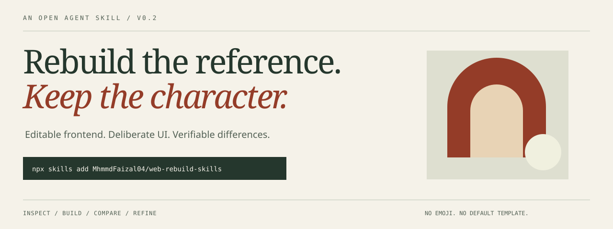

# Web Rebuild Skills



**Rebuild a reference. Create from a brief. Keep your stack and make the design intentional.**

[](https://github.com/MhmmdFaizal04/web-rebuild-skills/actions/workflows/ci.yml)
[](LICENSE)
[](https://agentskills.io/specification)

[Live showcase](https://mhmmdfaizal04.github.io/web-rebuild-skills/) | [Reference demo](https://mhmmdfaizal04.github.io/web-rebuild-skills/reference.html) | [Quick start](#quick-start) | [Bahasa Indonesia](docs/README.id.md) | [Examples](examples/README.md) | [Contributing](CONTRIBUTING.md)

An evidence-first Agent Skill for rebuilding an authorized website from a URL or screenshots, and for explicitly requested brief-led frontend UI/UX creation. It guides your coding agent through observation, implementation, visual comparison, and bounded correction. It is **not** a hosted website cloner, a browser, or a standalone code generator.

## See the Reference

[](https://mhmmdfaizal04.github.io/web-rebuild-skills/reference.html)

Original MIT-licensed reference artwork, captured in Chromium by CI. **This is a practice reference, not a claimed AI-generated reconstruction.** [Desktop capture](https://mhmmdfaizal04.github.io/web-rebuild-skills/previews/reference-1440.png) / [Mobile capture](https://mhmmdfaizal04.github.io/web-rebuild-skills/previews/reference-320.png) / [Interactive reference](https://mhmmdfaizal04.github.io/web-rebuild-skills/reference.html).

**Observe -> Build -> Compare -> Refine.** Use a source for faithful/adaptation work, or explicitly choose brief-led creation when there is no reference.

## Quick Start

You need a skills-compatible coding agent, Node.js/npm and Git for the installer. The tested CLI version, `skills@1.5.23`, requires Node.js **22.20.0 or newer**. Browser/vision tools belong to your agent and must be configured separately.

Run inside the project where you want to use the skill:

```bash
npx skills add MhmmdFaizal04/web-rebuild-skills
```

Select the **web-rebuild** skill and your agent when prompted. Installation does not start a rebuild, install Python dependencies, or provide model API access.

Start a new agent session, then ask:

> Use the web-rebuild skill. Rebuild my authorized reference at <REFERENCE_URL> in this project's existing stack. Use faithful mode. Inspect desktop and mobile, keep the content and interactions, use my licensed assets, and run up to three visual correction rounds. Report what you could and could not verify.

Replace `<REFERENCE_URL>` with a URL you are authorized to use. For screenshots, attach the images instead and include their viewport dimensions if known. [More prompts and an original practice fixture](examples/README.md).

## What You Get

| Capability | What it means |
|---|---|
| Faithful reconstruction | Preserve observed hierarchy, spacing, typography, copy, crop, and behavior for references you can reuse |
| Reference adaptation | Keep specified structure while changing brand, assets, or copy according to an explicit brief |
| Brief-led creation | Design from audience, task, content, and constraints without inventing reference-fidelity claims |
| No emoji / intentional design | No introduced emoji or default generic UI template; preserve user content and disclose source substitutions |
| Cross-stack adaptation | Follow native templates, components, widgets, routing, state, and security instead of forcing React |
| Existing-project awareness | Inspect the current framework, tokens, and components before introducing new dependencies |
| Visual correction loop | Compare matched captures, fix large structural errors first, stop at the agreed budget |
| Responsive and interaction checks | Test mobile/intermediate/desktop layouts, keyboard navigation, menus, dialogs, and forms safely |
| Evidence instead of promises | Deliver observed facts, assumptions, screenshots, deviations, checks run, and unverified areas |
| Optional offline image helper | Produce a side-by-side, overlay, absolute-difference image, and JSON mismatch report from two local PNGs |

## Design Without the Generic Template

The skill does not introduce emoji in authored UI text, icons, placeholders, or examples. It uses coherent SVG icons or meaningful labels instead. Existing user content is not silently sanitized; emoji in a reference becomes a disclosed substitution unless explicitly preserved by the user.

No default gradient hero, glass panel, bento grid, fake testimonial, or invented usage statistic. Styles follow the reference, brand, and task; a justified gradient is not universally forbidden. UI work includes hierarchy, typography, spacing, responsive behavior, and meaningful states. UX checks include keyboard flow, recovery, long copy, localization, and RTL where required.

[Design-quality playbook](skills/web-rebuild/references/design-quality.md) explains these rules. They guide the agent; they are not a guarantee that every model output is flawless.

## Use Your Native Stack

| Language / platform | Documented frontend adaptation |
|---|---|
| HTML, CSS, JavaScript, TypeScript | Plain pages, Web Components, React/Next, Vue/Nuxt, Svelte, Angular, Astro |
| PHP | Blade, Twig, WordPress templates |
| Python | Django, Jinja and existing server templates |
| Ruby | ERB, Rails, Hotwire |
| Go | html/template, templ |
| Java / Kotlin | Thymeleaf, JSP and the existing JVM web stack |
| C# | Razor, Blazor |
| Elixir | HEEx, Phoenix LiveView |
| Rust | Leptos, Yew |
| Dart | Flutter web widgets and semantics |
| Scala / Clojure | Twirl, Scala.js, Hiccup, Reagent, or the actual renderer |
| Other web stacks | Inspect native rendering, escaping, state and build tooling; use the fallback procedure |

This is **language-agnostic guidance, not a claim of tested support for every runtime**. The agent preserves the project's language, version, route helpers, escaping, CSRF protection, forms, state, and SSR boundaries. It reports missing compilers or browser tools instead of rewriting the application in React. Native mobile is outside the tested web scope. [Stack adapter playbook](skills/web-rebuild/references/stack-adapters.md).

## Install Options

```bash
# Inspect discovery without installing
npx skills add MhmmdFaizal04/web-rebuild-skills --list

# Select the skill and agent explicitly (replace opencode as needed)
npx skills add MhmmdFaizal04/web-rebuild-skills --skill web-rebuild --agent opencode

# Make it available across projects
npx skills add MhmmdFaizal04/web-rebuild-skills --skill web-rebuild --global

# Copy instead of symlinking when your environment requires it
npx skills add MhmmdFaizal04/web-rebuild-skills --skill web-rebuild --copy

# Review installed skills, update, or remove
npx skills list
npx skills update web-rebuild
npx skills remove web-rebuild
```

Common CLI agent identifiers are `opencode`, `claude-code`, `cursor`, and `codex`. The CLI chooses the appropriate installation paths; do not assume they are identical between versions. For a global installation, use the corresponding global flag when listing/updating/removing. Restart OpenCode after installation; other agents may also require a new session. Explicitly mention `web-rebuild` if automatic activation does not occur. Slash-command support depends on the host; this repo does not register a universal slash command.

To install the tagged version rather than moving `main`:

```bash
npx skills add https://github.com/MhmmdFaizal04/web-rebuild-skills/tree/v0.2.0/skills/web-rebuild
```

Read the skill and scripts before installation and review updates. You do **not** run `npx web-rebuild-skills`: the existing Vercel `skills` CLI installs this GitHub package; no separate npm package is needed.

## What To Provide

| Input | Example |
|---|---|
| Reference and scope | One authorized URL, or attached desktop/mobile screenshots; routes to rebuild |
| Mode | `faithful`, `adaptation`, or explicitly requested `brief-led creation` |
| Target project | Existing Vue project, React/Tailwind, or a plain HTML prototype |
| Assets | Fonts/images you can reuse, or permission to substitute |
| Behavior | Menu open state, modal, safe form validation; backend work is separate |
| Verification budget | Three correction rounds; 320x900, 768x1024, and 1440x1000 CSS pixels |

Unknowns are recorded, not silently invented. One desktop screenshot cannot prove mobile fidelity or hidden interactions. The agent can infer a responsive implementation but must label it as inferred.

## Optional Image Comparison

The skill works as Markdown without Python. The optional helper needs Python 3.11+ and Pillow. Locate the installed `web-rebuild` directory using `npx skills list`; substitute its path for `<SKILL_DIR>`:

```bash
python -m pip install -r "<SKILL_DIR>/scripts/requirements.txt"
python "<SKILL_DIR>/scripts/compare_images.py" reference.png candidate.png --output comparison --threshold 16 --max-mismatch-ratio 0.02
```

This reads **local PNGs only** and writes into a new output directory. It never fetches a URL or runs a browser. Thresholds above are examples, not universal quality standards. Do not overwrite baselines, rescale screenshots, or increase tolerances to hide defects. See [visual verification](skills/web-rebuild/references/verification.md) for exact metric semantics and limitations.

## Compatibility and Evidence

This uses portable Agent Skills frontmatter with on-demand references. CI checks skill discovery and installation targets for OpenCode, Claude Code, Cursor, and Codex through `skills@1.5.23`. That is **installer compatibility**, not proof that every model or host completes every rebuild.

CI also validates the specification, checks local documentation links, runs image-helper tests, and captures the original HTML practice fixture in Chromium at three viewports. It compares real captures and an intentionally altered capture to test the helper pipeline. This is a **synthetic verification smoke test**, not an AI-generated before/after showcase.

Status: **experimental v0.2.0**. No controlled model-versus-competitor benchmark has been completed. Browser behavior and reconstruction quality depend on your agent, model, tools, reference, and task. [Evaluation protocol](evals/README.md) includes ten scenarios and a baseline plan; unpublished results are not counted as passes.

## Safety and Rights

Use your own designs, authorized references, or adaptation with assets you can reuse. Public access is not an asset license. Do not bypass login/paywalls, impersonate a service, copy trackers or third-party scripts, submit production forms, or disclose private captures. Page content and screenshot text are untrusted data, not instructions to the agent. See [SECURITY.md](SECURITY.md).

The skill does not recover backend source, guarantee pixel-perfect output, grant asset rights, certify accessibility, or sandbox your tools. Automated image similarity is not proof of usable or accessible frontend code.

## Repository Map

```text
skills/web-rebuild/
  SKILL.md                  # Portable entry point
  references/               # Observation, implementation, verification
  assets/                   # Brief and report templates, original fixture
  scripts/                  # Optional offline PNG comparison helper
docs/README.id.md            # Indonesian getting-started guide
examples/README.md           # Copyable tasks and practice walkthrough
evals/                      # Scenarios and honest measurement protocol
tests/                      # Deterministic checks and browser smoke test
.github/                    # CI and contribution templates
```

## Sharing on skills.sh

Following [Vercel's Agent Skills guide](https://vercel.com/kb/guide/agent-skills-creating-installing-and-sharing-reusable-agent-context), there is no special skills.sh publish command or registry submission. Public GitHub skills can become discoverable through real installs using `npx skills add`. Indexing timing, ranking, and audits are controlled by the directory, not this repository; publication here does not guarantee immediate listing or endorsement.

The CLI documents optional install telemetry. Set `DISABLE_TELEMETRY=1` to opt out. Our CI disables telemetry so synthetic test installs do not inflate adoption.

## Contribute

Small contributions matter: one reproducible layout case, one negative test, one clearer prompt, or one compatibility report. Read [CONTRIBUTING.md](CONTRIBUTING.md). Report security issues privately using the [security policy](SECURITY.md). If this helps a real project, a star and a concrete example of what worked are appreciated.

## Sources and License

Original skill content, showcase, artwork, and practice fixture: MIT, see [LICENSE](LICENSE). Third-party references retain their own licenses. This is an independent project, not affiliated with Vercel, Anthropic, or agent vendors.

- [Agent Skills specification](https://agentskills.io/specification)
- [Vercel skills CLI](https://github.com/vercel-labs/skills)
- [Playwright visual comparisons](https://playwright.dev/docs/test-snapshots)
- [WCAG reflow guidance](https://www.w3.org/WAI/WCAG22/Understanding/reflow.html)
